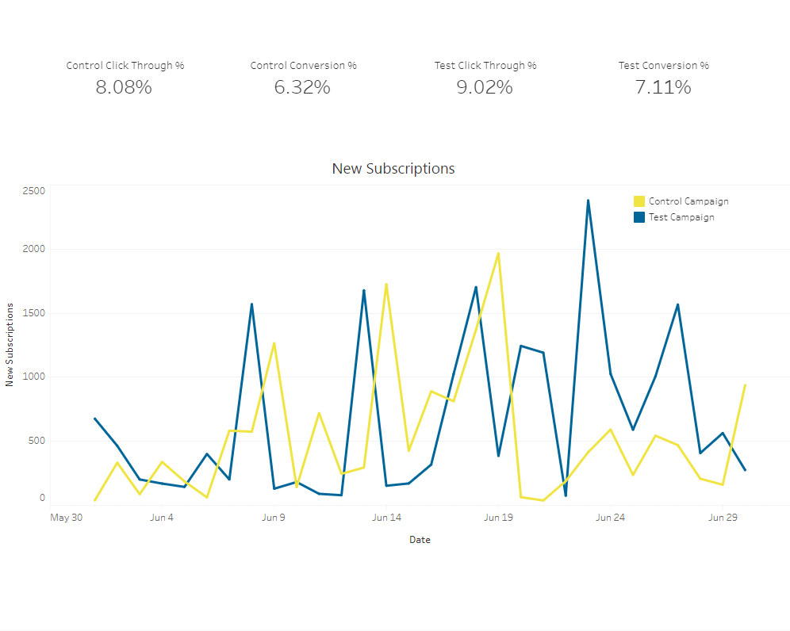

# Market-Research-and-Competitive-Analysis
Evaluated the effectiveness of different marketing strategies using A/B testing data, identified and analyzed key competitors' strategies with a SWOT analysis, and persormed data analysis in Excel and Tableau to provide actionable recommendations.

<!-- TABLE OF CONTENTS -->

  
Table of Contents

  <ol>
    <li><a href="#summary">Summary</a></li>
    <li><a href="#introduction">Introduction</a></li>
    <li><a href="#scope">Scope</a></li>
    <li><a href="#methodology">Methodology</a></li>
    <li><a href="#market-research">Market Research</a></li>
    <li><a href="#competitive-analysis">Competitive Analysis</a></li>
    <li><a href="#data-analysis">Data Analysis</a></li>
    <li><a href="#insights-and-recommendations">Insights and Recommendations</a></li>
    <li><a href="#conclusion">Conclusion</a></li>    
  </ol>

<!-- Summary -->
## Summary

This report presents a comprehensive market research and competitive analysis for a leading fitness subscription service, aiming to optimize marketing strategies and increase market share. Using A/B Testing, we evaluated various marketing changes and their impact on conversion rates. The analysis revealed a statistically significant increase in conversions from 6.32% to 7.11% in the test group, demonstrating the effectiveness of the tested marketing change.

Key competitors in the fitness subscription market, were analyzed to understand their strengths, weaknesses, and marketing strategies.

Our recommendations include implementing the successful marketing change from the A/B test across all users, exploring additional A/B tests to further optimize marketing strategies, and leveraging personalized content to enhance customer engagement. These strategies are expected to improve market share and competitive positioning in the rapidly growing fitness subscription market.

(<a href="#readme-top">back to top</a>)

<!-- Introduction -->
## Introduction
The fitness subscription service industry is experiencing significant growth, with major players including:

* Cycle App
* All in One App
* Treadmill App
* Beach App
* Globo Gym App
* Fitness+ App

Among these, Cycle App and All in One App hold the largest market shares. Our objective is to enhance the market share of Fitness+ by refining our marketing strategies. This report will evaluate the effectiveness of various marketing approaches using A/B testing data, analyze key competitors' strategies, and provide actionable recommendations to optimize future marketing campaigns.

(<a href="#readme-top">back to top</a>)

<!-- Scope -->
## Scope
This project will include the following:

* Identification and analysis of key competitors, including a SWOT analysis
* Analysis of A/B test data to evaluate marketing campaign performance
* Visualization of key insights and findings using Tableau.
* Development of a comprehensive report to communicate results
* Provision of actionable insights and recommendations for optimizing future marketing campaigns

The project will exclude:

* Primary data collection through surveys or interviews
* Customer segmentation based on demographic and psychographic data
* Detailed financial analysis of competitors
* Long-term tracking and analysis beyond the scope of the provided dataset

(<a href="#readme-top">back to top</a>)

<!-- Methodology -->
## Methodology

The A/B test dataset comprises randomly generated data for both a control and a test marketing campaign, representing website traffic and new subscriptions for the Fitness+ App during June 2024. The dataset includes daily counts for impressions, click-throughs, and new subscriptions for each campaign.

The A/B test data will be analyzed using Excel and Tableau to determine conversion rates and assess the statistical significance of the results between the two campaigns.

Additionally, a SWOT (Strengths, Weaknesses, Opportunities, Threats) analysis will be conducted using key competitors' products and publicly available financial data.

(<a href="#readme-top">back to top</a>)

<!-- Market Research -->
## Market Research

#### Fitness+

Product Overview:
* Strength workouts and pre-recorded instructor led classes
* Personalized plans and challenges
* App available on mobile, web

Price:
* $8.99/mo or $5.99/mo with annual subscription

### Key Competitors:

#### Cycle App

Product Overview:
* Live and pre-recorded classes for exercise bike, rower, and treadmill
* Strength, yoga, outdoor running, and HIIT classes
* App available on mobile, web, and smart TV
* Activity tracking
* Pre-made programs and challenges
* Smart watch and heart rate monitor connectivity
* Equipment required to access all features

Price:
* $24/mo or $20/mo with annual subscription for Cycle App

Current market share, sales, revenues:
* $2.2B annual revenue from services (memberships) in 2023
* Services revenue at an all-time high in 2023, but total revenue decreased to $3.2B from the all-time high of $4.5B in 2021
* Annual users decreased to 5.4M in 2023 from 6.8M in 2022

#### All in One App

Product Overview:
* 12 workout types including HIIT, yoga, strength, and running
* Pre-recorded classes
* Customized plans
* Smart Watch and heart rate monitor connection

Price:
* $9.99/mo or $6.66/mo with annual subscription
* 3 months free with purchase of qualifying phones and tablets

Current market share, sales, revenues:
* All in One does not release specific earnings reports for All in One App
* Despite being newer, it potentially has a wider customer base due to bundling with other All in One subscriptions

#### Treadmill App

Product Overview:
* Automatically adjusts treadmill settings during workouts
* Includes additional strength and yoga workouts
* Allows creation of custom routes using Google Maps
* Equipment required to access all features

Price:
* $33/mo with one year subscription
* $29.12/mo with two year subscription
* $24.97/mo with three year subscription

Current market share, sales, revenues:
* $9.3M revenue in May 2024

#### Beach App

Product Overview:
* 130+ programs including several viral on social media
* Cardio, weightlifting, fitness, core, yoga, stretching, Pilates classes, no live options
* Meal plans
* MLM structure

Price:
* $35/mo or $14.91/mo with annual subscription

Current market share, sales, revenues:
* Digital revenue of $55.5M in Q1 2024, down from $68.2M in Q1 2023
* 2.22M digital subscriptions in Q1 2024, down from 3.75M in Q1 2023

#### Globo Gym App

Product Overview:
* Cardio, weightlifting, martial arts, and cycling classes, no live options
* 3-12 week workout plans
* Equipment required to access all features

Price:
* $4.99/mo with annual subscription for Base App
* $9.99/mo with annual subscription for Premium App

Current market share, sales, revenues:
* No publicly available earnings info for Globo Gym App

(<a href="#readme-top">back to top</a>)

<!-- Competitive Analysis -->
## Competitive Analysis

### SWOT Analysis
#### Strengths

Does Not Require Specific Equipment:
* Fitness+ does not necessitate the purchase of proprietary equipment, unlike some competitors, making it more accessible to a broader audience.

Focused Classes, Not Generalized:
* The app offers specialized classes, providing a more targeted and personalized workout experience for users interested in strength training and personalized plans.

Lower Price Than Most Competitors:
* With a subscription cost of $8.99 per month (or $5.99 per month with an annual subscription), Fitness+ is more affordable than many competitors, making it an attractive option for cost-conscious consumers.

#### Weaknesses

No Live Classes:
* Fitness+ lacks live classes, which are popular among users who seek real-time engagement and motivation from instructors.

Newer App, Less Recognizable:
* As a newer entrant in the market, Fitness+ lacks the brand recognition of more established competitors, potentially making it harder to attract new users.

#### Opportunities

Growing Industry with Declining Revenue for Legacy Companies:
* The fitness subscription industry is expanding, while revenue for some legacy companies is declining. This creates an opportunity for newer and smaller companies like Fitness+ to capture a larger market share.

Negative Connotation of MLM Structure for Beach App:
* The MLM structure of Beach App may alienate a segment of potential customers, presenting an opportunity for Fitness+ to attract users looking for a more straightforward subscription model.

Strength-Focused Niche:
* Many competitors focus primarily on cardio workouts, with strength training as a secondary component. By specializing in strength workouts, Fitness+ can carve out a niche market and appeal to users specifically interested in this type of exercise.

Shift Away from Expensive Equipment and Subscriptions:
* With the rising cost of living, consumers may move away from expensive equipment and high-cost subscriptions offered by companies like Cycle App and Treadmill App. Fitness+'s affordable pricing and no-equipment model could become increasingly appealing.

#### Threats

Potential All in One-Cycle App Acquisition:
* Rumors of All in One purchasing Cycle App pose a significant threat, as All in One already offers a highly comparable product with a vast user base and ecosystem. Such an acquisition could consolidate market power and reduce Fitness+'s competitive edge.

Popularity of Cardio and Boutique Fitness:
* Cardio and boutique fitness classes remain very popular. The strength-focused approach of Fitness+ might limit its overall potential market, especially if consumers continue to favor cardio-based workouts.

(<a href="#readme-top">back to top</a>)

<!-- Data Analysis -->
## Data Analysis

### Campaign Design

#### Objective:

The A/B test campaign was designed to leverage the identified strengths and opportunities of Fitness+ to determine the effectiveness of specific marketing changes aimed at increasing user engagement and conversions.

#### Test Campaign Features:

* Personalized Plans: The test campaign highlighted personalized strength training plans, emphasizing Fitness+'s strength-focused niche.
* Affordable Pricing: The marketing messages underscored the lower cost compared to competitors, aiming to attract cost-conscious consumers.
* No Proprietary Equipment Needed: The campaign emphasized that Fitness+ does not require specific equipment, making it accessible to a wider audience.
* Engaging Content: The campaign included detailed descriptions of the variety of strength workouts and the benefits of personalized plans, appealing to users looking for specialized training.

#### Control Campaign Features:

* General Marketing Messages: The control group received standard marketing messages that did not highlight the specific strengths and opportunities.
* Basic Workout Descriptions: The descriptions focused on general fitness benefits without emphasizing the personalized or strength-focused aspects.

### Methodology

The dataset contains daily counts of impressions, click-throughs, and new subscriptions for each campaign during June 2024. The analysis was conducted using Excel and Tableau to calculate conversion rates and assess the statistical significance of the results between the control and test groups.

### Data Points:

#### Control

* Impressions: 3102420
* Click-Throughs: 250797
* Subscriptions: 15838

#### Test

* Impressions: 3118680
* Click-Throughs: 281280
* Subscriptions: 19990

#### Conversion Rates Calculation:

$ConversionRate = {Subscriptions \over Impressions} * 100$

Control Conversion Rate: 6.32%
Test Conversion Rate: 7.11%

Tableau Dashboard

[Interactive Dashboard](https://public.tableau.com/views/ABTestResults_17218365404810/Dashboard1?:language=en-US&:sid=&:redirect=auth&:display_count=n&:origin=viz_share_link)

#### Statistical Significance:

Standard error and a Z-score were calculated to determine the statistical significance of the difference in conversion rates between the control and test groups.

$se = \sqrt{(ControlConversionRate*{(1-ControlConversionRate) \over ControlClickThrough})+(TestConversionRate*{(1-TestConversionRate) \over TestClickThrough})}$ 

Standard Error: 0.000686004

$Z-Score = {(TestConversionRate - ControlConversionRate) \over se}$

Z-score: 11.54118114

The results show that the test campaign achieved a conversion rate of 7.11%, compared to 6.32% for the control group. The Z-score of 11.54 indicates a highly significant difference, suggesting that the changes implemented in the test campaign had a substantial positive impact on conversions.

(<a href="#readme-top">back to top</a>)

<!-- Insights and Recommendations -->
## Insights and Recommendations

### Key Insights:

Emphasizing personalized strength training plans and affordable pricing can significantly increase user engagement and conversion rates.

Highlighting the accessibility of the app, which does not require specific equipment, appeals to a broader audience.

### Recommendations:

* Expand Personalized Plans: Continue to develop and promote personalized strength training plans as a key differentiator.
* Maintain Affordable Pricing: Keep subscription costs competitive and consider offering periodic discounts to attract new subscribers.
* Emphasize Accessibility: Regularly highlight that no specific equipment is required, making the app accessible to more users.
* Leverage Test Campaign Insights: Implement similar marketing strategies across all campaigns to enhance overall conversion rates.

(<a href="#readme-top">back to top</a>)

<!-- Conclusion -->
## Conclusion

This market research and competitive analysis report for Fitness+ has provided valuable insights into the current landscape of the fitness subscription service industry and identified key areas for growth and improvement. By leveraging the A/B testing data, we have been able to assess the effectiveness of various marketing strategies and provide data-driven recommendations.

Our analysis revealed that Fitness+ has several strengths, including its affordability, specialized strength-focused workouts, and the absence of required proprietary equipment, which makes it accessible to a broader audience. However, the app's lack of live classes and its relative newness in the market pose challenges that need to be addressed.

The A/B test results showed a significant improvement in conversion rates when the marketing campaign emphasized personalized plans, affordability, and accessibility. This highlights the potential for Fitness+ to increase its market share by focusing on these areas in future campaigns.

The competitive analysis identified major players like Cycle App, All in One App, Treadmill App, Beach App, and Globo Gym App. While these competitors have their own strengths, they also present opportunities for Fitness+ to differentiate itself, particularly in the niche of strength-focused training.

### Notes and limitations: 
All companies and related data in this report are fabricated. In particular the financial data of the competitors and the A/B test dataset were randomly generated for use in this project. The results and conclusions shouls not be applied to any real world scenario without performing this analysis again with real data and companies.

(<a href="#readme-top">back to top</a>)

